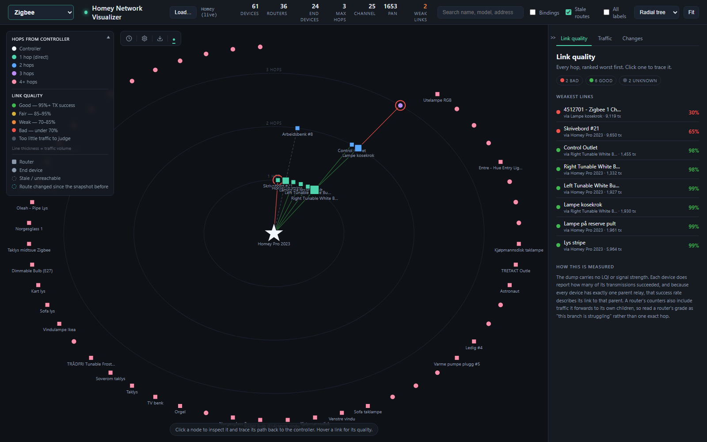
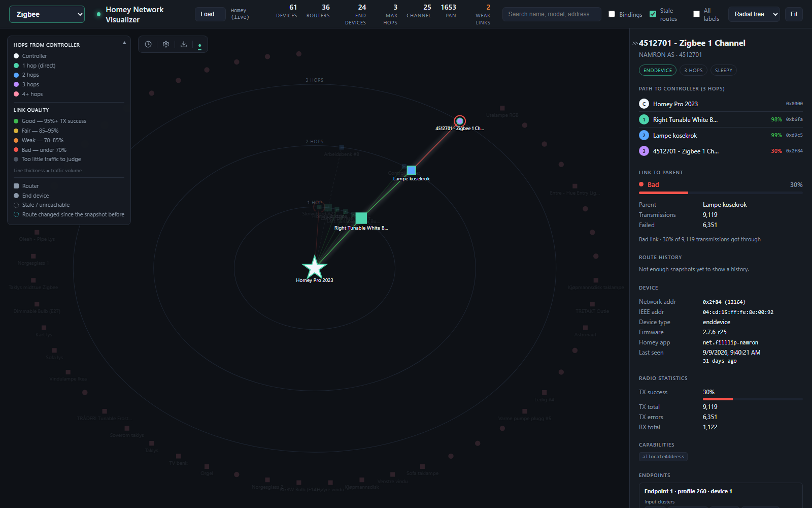

# Network Visualizer for Homey

See how your devices really reach Homey, and where the signal struggles.

Network Visualizer is a [Homey Pro](https://homey.app) app that draws your **Zigbee**, **Thread & Matter**
and **Z-Wave** networks as a map: every device, the route it takes back to Homey, and a quality grade on
every link, with the weakest links listed first.



## Why

Zigbee and Thread are mesh networks. Most devices don't talk to Homey directly; they hand their messages
to a nearby mains-powered device (a bulb, a plug), which passes them on. That is what lets a mesh cover a
whole house, but it also means **one bad relay can slow down a whole branch**. A sensor that reacts late,
a bulb that sometimes misses a command: the cause is often a weak link two hops away, not the device itself.

Homey shows you a list of devices, not the routes between them. This app shows the routes, so you can see:

- which devices each device relays through, and how many hops it is from Homey,
- which links lose messages, ranked worst first,
- which router a whole group of devices depends on,
- what changed over time: devices that switched parent, joined or left.

With that you know where a repeater, a move of a plug, or a re-pair will actually help.

## What you get

The same map is available in three places:

| Where | What it is |
| --- | --- |
| **App settings** | The map inside the Homey app. Pick a network at the top, tap a device to trace its route, go fullscreen for more room. |
| **Browser view** | The full visualizer in a browser tab on your local network, with snapshot history, a Changes tab, route history per device, and export. Off until you switch it on. |
| **Dashboard widget** | A small read-only map for your Homey dashboards. Tap a device to see its route. |


## How to use it

### 1. Install

Install **Network Visualizer** from the [Homey App Store](https://homey.app/a/no.arvebjoe.network-visualizer/).
It needs Homey Pro with firmware 12.4.0 or later.

The app asks for permission to read Homey's own state through the Web API (`homey:manager:api`). That is
how it reads the Zigbee, Thread, Matter and Z-Wave information; it never changes anything.

### 2. Open the map

In the Homey app, go to **More → Apps → Network Visualizer → Configure app**. The map opens with your
Zigbee network.

- **Network picker** (top): Zigbee, Thread & Matter, or Z-Wave. The choice is remembered.
- **Tap a device** to trace its route back to Homey and see the grade of every hop on the way.
- **Fit**, **Fullscreen**, **+ / −** to find your way around. On a phone held upright, fullscreen turns the
  map sideways, so turning the phone gives you a wide view.
- **All labels** names every device; otherwise only routers and the selected device are named.
- **Stale routes** shows routing entries that point at an address no device has any more (Zigbee).
- **Reload** reads the network again.

Below the map, **Link quality** lists every link, worst first. Tap one to trace it.

### 3. Read the map

- **Homey** is the star in the middle. Rings show the hop count: 1 hop is a direct link, 2 hops goes
  through one router, and so on.
- **Squares** are routers (mains-powered devices that relay for others), **circles** are end devices
  (usually battery-powered sensors and remotes).
- **Line colour** is the link's grade; **line thickness** is how much traffic goes over it.

| Grade | Zigbee and Z-Wave: messages that got through |
| --- | --- |
| 🟢 Good | 95% or more |
| 🟡 Fair | 85–95% |
| 🟠 Weak | 70–85% |
| 🔴 Bad | under 70% |
| ⚪ Too little traffic | fewer than 30 messages, too few to judge |

Zigbee and Z-Wave are graded by how many of a device's transmissions succeeded, since that is what Homey
reports. A router's count includes the traffic it forwards for its own children, so a bad grade on a
router reads as "this branch is struggling". Thread is graded by link quality and signal strength, which
Thread reports per link.



### 4. Switch on the browser view (optional)

At the bottom of the settings page, turn on **Browser view**. The page then shows its address, something
like `http://192.168.1.10:8154/`, and on a computer the **Browser** button opens it.

> [!WARNING]
> The browser view has **no login**. While it is on, anyone on your local network can open it and see
> your device names and network layout. It only answers on your local network, and it never shows the
> network key. Switch it off when you don't need it.

The browser view adds:

- **Snapshot history.** Click the gear in the history bar and switch on **Save snapshots**, per network,
  every 1, 2, 4 or 8 hours, keeping the last 2 to 24. Step back through them with the history bar.
  Changing the interval clears that network's history.
- **Changes tab.** Devices that switched parent, joined or left since the previous snapshot are listed
  and ringed on the map.
- **Route history.** Selecting a device shows every parent it has had, with a warning when it keeps
  switching.
- **Traffic tab.** The busiest devices, with how many of their messages failed.
- **Layouts.** A radial tree (by hop count) or a force-directed mesh.
- **Search** by name, model or address, and **Bindings** to show which devices are bound to each other.
- **Download** the whole Zigbee history as one file, summarised so you can hand it to an AI and ask what
  is going on.
- **Load…** a saved Zigbee dump, or a raw dump of every network, to look at it here. The Load dialog can
  also download that raw dump from your Homey, which helps when reporting a problem.

### 5. Add the dashboard widget (optional)

Edit a Homey dashboard, add a widget, and pick **Network map** from Network Visualizer. In its settings
you choose:

- the **network** (Zigbee, Thread & Matter, Z-Wave),
- the **shape**: square, wide or tall,
- which devices are **named**: only the one you tap, routers, or all,
- whether to show the **link quality counts** and Zigbee's **stale routes**,
- how often it **refreshes**, in minutes.

The widget never pans or zooms, so swiping over it still scrolls the dashboard.

## Networks and their limits

| Network | What the map shows |
| --- | --- |
| **Zigbee** | The full mesh: every device, its route to Homey through other devices, and each hop graded. Also stale routes, address conflicts and bindings. |
| **Thread & Matter** | Thread routers and their children, with the cheapest route from Homey's border router, named after your Matter devices. Matter devices on Wi-Fi or Ethernet are joined straight to Homey. |
| **Z-Wave** | Every device, graded by how many of Homey's messages got through. Homey doesn't let apps read Z-Wave routes, so every device is drawn joined straight to Homey. A read-only way to get them has been [requested from Athom](https://github.com/athombv/homey-web-api-issues/issues/73). |

## Privacy

Everything stays on your Homey. The app has no cloud service and sends nothing anywhere. The Zigbee network
key is stripped before anything is stored, shown, exported or downloaded, and that goes for imported dumps
too.

## Feedback

Questions and ideas: the [community thread](https://community.homey.app/t/zigbee-network-visualizer/159739).
Bugs: [GitHub issues](https://github.com/arvebjoe/no.arvebjoe.network-visualizer/issues). If the map looks
wrong, attaching the raw dump from the browser view's Load dialog helps a lot.

## Development

TypeScript, Homey SDK 3, ES modules. The browser view in `web/` is plain JavaScript with a vendored d3 and
no build step.

```bash
npm install
homey app run        # run on your Homey
homey app validate --level publish
npm run lint
```

[CLAUDE.md](CLAUDE.md) describes the code layout and the reasoning behind the less obvious choices.

## License

GPL-3.0. See [LICENSE](LICENSE).
